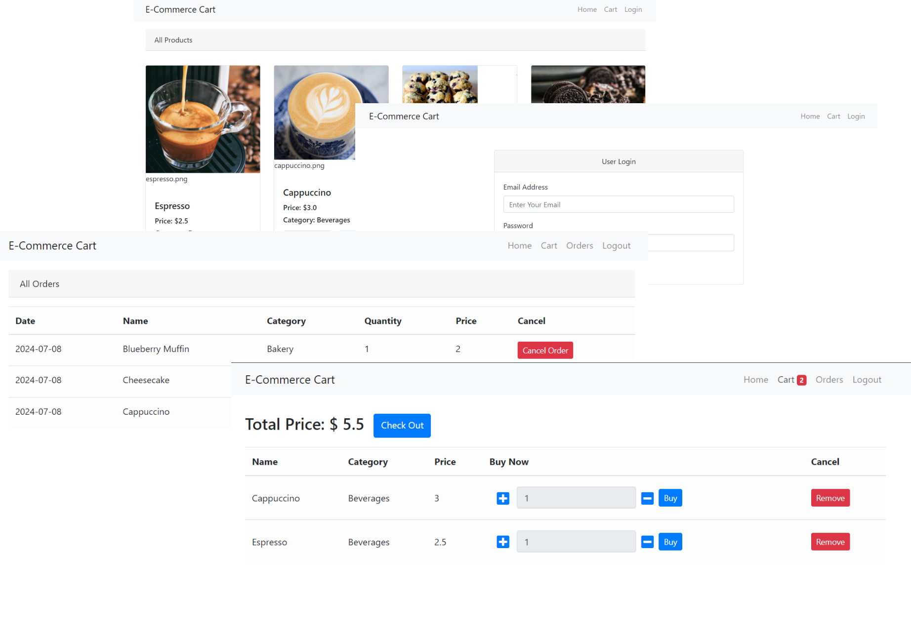

# Add to cart

## Features

- **User Authentication**: Users can log in to access their cart and place orders.
- **Product Management**: Users can view and add products to their cart.
- **Order Management**: Users can place orders and view their order history.

## Technologies Used

- **JSP**: For building dynamic web pages.
- **Servlets**: For handling HTTP requests and business logic.
- **JDBC API**: For database connectivity and operations.
- **Bootstrap**: For responsive design and styling.
- **CSS**: For additional styling.

## Folder Structure

- **product-image**: Contains JSP files for various pages like cart, index, login, and orders.
- **database**: Contains SQL scripts for database setup.
- **src**: Contains Java classes for servlets and JDBC operations.
  - **connection**: Contains classes for database connection.
  - **dao**: Contains Data Access Objects (DAOs) for database operations.
  - **model**: Contains model classes.
  - **servlet**: Contains servlet classes for handling HTTP requests.

### Output

